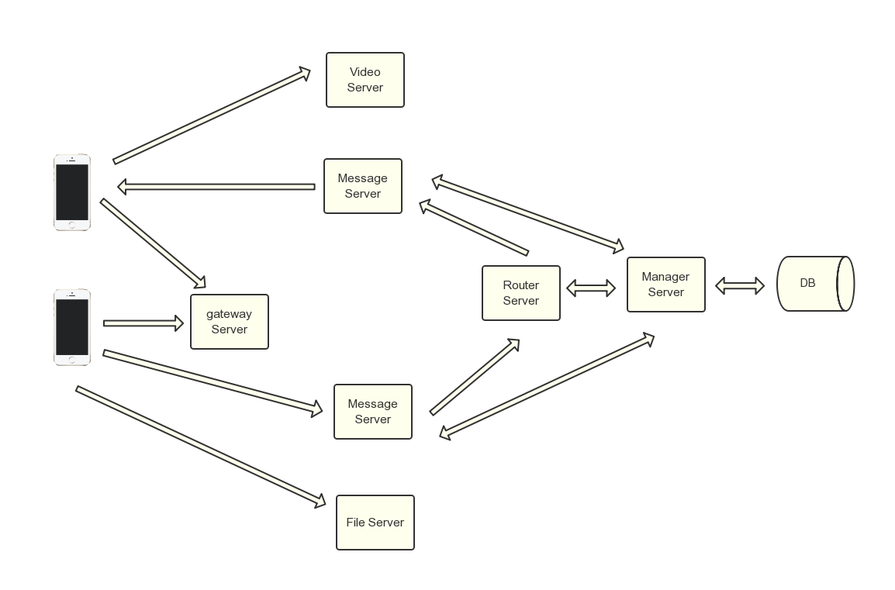
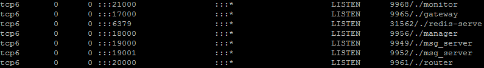
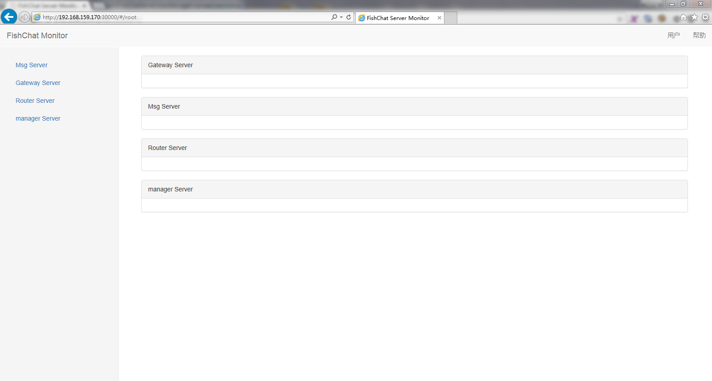

FishChatServer
======

FishChat(鱼传 - `鱼传尺素`) - FishChat是一款优秀的即时通讯软件(IM), 它集合了市面上已有产品的优点, 并具备**智能硬件网关管理(代码不是很成熟, 暂不公开)**. 我们的目标是：让智能硬件“聊”起来！
> **NOTE:** 鱼传取自古乐府《饮马长城窟行》`客从远方来, 遗我双鲤鱼. 呼儿烹鲤鱼, 中有尺素书.` 

FishChat的访谈 : http://www.oschina.net/question/2306979_236368

FishChat Android客户端见 https://github.com/oikomi/FishChatAndroid (紧张开发中, not usable yet)

**FishChatServer的Java版本同时也在开发中 (https://github.com/oikomi/FishChatServerJava)**

Table of Contents
=================

* [FishChatServer](#fishChatServer)
* [Status](#status)
* [Todo](#todo)
* [FIXME](#FIXME)
* [系统架构](#系统架构)
* [关键服务器详解](#关键服务器详解)
	* [gateway](#gateway)
    * [msg_server](#msg_server)
    * [router](#router)
    * [manager](#manager)
    * [monitor](#monitor)
* [存储](#存储)
* [依赖](#依赖)
* [部署](#部署)
* [监控](#监控)
* [测试](#测试)
* [技术细节](#技术细节)
* [Copyright & License](#Copyright & License)

Status
======

It is not usable yet and still under early development.

[Back to TOC](#table-of-contents)

Todo
======
- [x] support p2p communication
- [x] support group communication
- [ ] support message encryption
- [ ] support file transfer
- [ ] support audio
- [ ] support video

[Back to TOC](#table-of-contents)

FIXME
======
- [ ] signal process (SIGPIPE ...)
- [ ] timer support  

[Back to TOC](#table-of-contents)

系统架构
======

[Back to TOC](#table-of-contents)

关键服务器详解
======
### gateway
gateway server主要是接受client请求，进行通用的功能设置，目前这块只做了分配msg_server的功能，后面可根据需要进行扩展

在gateway server的配置文件中最重要的是配置msg_server列表
<pre><code>"MsgServerList"      : [
		"192.168.159.169:19000",
		"192.168.159.169:19001"
	],
</code></pre>

### msg_server
msg_server是消息的主体，维护着客户端连接和keeplive,同时要注意router、manager和monitor都订阅了msg_server的channel
<pre><code>
	SYSCTRL_CLIENT_STATUS = "/sysctrl/client-status"
	SYSCTRL_TOPIC_STATUS  = "/sysctrl/topic-status"
	SYSCTRL_TOPIC_SYNC    = "/sysctrl/topic-sync"
	SYSCTRL_SEND          = "/sysctrl/send"
	SYSCTRL_MONITOR       = "/sysctrl/monitor"
	STORE_CLIENT_INFO     = "/store/client-info" 
	STORE_TOPIC_INFO      = "/store/topic-info" 
</code></pre>
这些channel保证了msg_server在事件触发时会广播通知后面的router、manager和monitor服务

### router
router顾名思义是做了msg_server之间的消息转发

### manager
manager主要是管理client信息存储、topic信息存储、离线消息存储等等，通过它和redis、mongodb联系

### monitor
monitor主要是收集监控各服务器状态信息，目前monitor是可选项，可按需要启动它

[Back to TOC](#table-of-contents)

存储
======
FishChatServer通过Redis做cache以及使用MongoDB做持久化存储

[Back to TOC](#table-of-contents)

依赖
======
FishChatServer采用了redis和MongoDB分别做cache和持久化存储，需要安装两者的驱动：
FishChatServer的web监控用到了beego框架：

<pre><code>
go get gopkg.in/mgo.v2
go get github.com/garyburd/redigo

go get github.com/astaxie/beego
</code></pre>

[Back to TOC](#table-of-contents)

部署
======
FishChatServer采用分布式可伸缩部署方式(各类服务器角色都可以动态增减)。如果没有多机条件，可以单机部署：

单机测试部署(建议配置) 

*   gateway一台
*   msg_server两台
*   router一台
*   manager一台
*   monitor一台

> **NOTE:**  FishChatServer依赖**redis**,请先启动redis,让它监听在默认端口

同时需要注意：

> **NOTE:**  注意FishChatServer的持久化存储采用了MongoDB(http://www.mongodb.org/), 需要启动mongod

<pre><code>
./gateway

./msg_server -conf_file=msg_server.19001.json

./msg_server -conf_file=msg_server.19000.json

./router

./manager

./monitor
</code></pre>

> **NOTE:**  可以通过修改各文件夹下面的json配置文件配置服务器参数

按上面的默认启动方式，查看系统的监听端口如下

> **NOTE:** router、manager和monitor一定要在msg_server启动之后启动，因为他们都订阅了msg_server的channel 

[Back to TOC](#table-of-contents)

监控
======
当启动了monitor后，monitor将在30000端口开启一个http监听，提供web化的服务器集群监控

技术方案采用angularJS和bootstrap(暂时没有太多精力做)

[Back to TOC](#table-of-contents)

测试
======
<pre><code>
测试点对点聊天
cd client/client_p2p
go build

测试群聊
cd client/client_topic
go build
</code></pre>

> **NOTE:** FishChatAndroid暂时不可用 

[Back to TOC](#table-of-contents)

技术细节
======
FishChatServer的消息系统完全采用Golang开发(https://golang.org/)

音视频方案
---------------------
音视频采用nginx-rtmp架构,借助ffmpeg技术,客户端推送rtmp流,服务器输出hls流

关键协议
---------------------
## 1. client to gateway

##### REQ_MSG_SERVER_CMD

**format:** *REQ_MSG_SERVER*

client use this cmd to get a msg_server addr from gateway

##### SELECT_MSG_SERVER_FOR_CLIENT_CMD

**format:** *SELECT_MSG_SERVER_FOR_CLIENT msg_server_ip*

gateway return msg_server addr to client

## 2. client to msg_server

##### SEND_PING_CMD

**format:** *SEND_PING*

client use this cmd to keep alive status in msg_server.

##### SEND_CLIENT_ID_CMD

**format:** *SEND_CLIENT_ID CLIENT_ID*

client use this cmd to send unique ID to msg_server.

##### LOCATE_TOPIC_MSG_ADDR_CMD

**format:** *LOCATE_TOPIC_MSG_ADDR MsgServerAddr topic_name*

send the msg_server addr that having the topic you want.

##### CREATE_TOPIC_CMD

**format:** *CREATE_TOPIC topic_name*

client use this cmd to CREATE TOPIC.

##### JOIN_TOPIC_CMD

**format:** *JOIN_TOPIC topic_name ID*

client use this cmd to JOIN TOPIC.

## 2. router,manager,monitor to msg_server

##### SUBSCRIBE_CHANNEL_CMD

**format:** *SUBSCRIBE_CHANNEL channelName*

router,manager,monitor use this cmd to SUBSCRIBE channel from msg_server.

##### ROUTE_MESSAGE_P2P_CMD

**format:** *ROUTE_MESSAGE_P2P send2ID send2Msg*

router use this cmd to router message between msg_servers.

[Back to TOC](#table-of-contents)

Copyright & License
===================

Copyright 2014-2015 Hong Miao (miaohong@miaohong.org). All Rights Reserved.

Licensed under the Apache License, Version 2.0 (the "License");
you may not use this file except in compliance with the License.
You may obtain a copy of the License at

http://www.apache.org/licenses/LICENSE-2.0

Unless required by applicable law or agreed to in writing, software
distributed under the License is distributed on an "AS IS" BASIS,
WITHOUT WARRANTIES OR CONDITIONS OF ANY KIND, either express or implied.
See the License for the specific language governing permissions and
limitations under the License.

